# Cursor Rules Organization

A comprehensive framework for organizing Cursor AI rules in large projects with **hybrid modular tool system** and automated role factory. This repository provides a scalable structure for domain-specific rules, role-based personas, and development tooling with enterprise-grade automation and intelligent tool synchronization.

## 🎯 Recent Achievements (v2.5)

**✅ Domain Metadata Enhancement** - Enhanced schema with status tracking, template types, required sections, and automated governance

**✅ Metadata-Driven Architecture** - Tool registry now serves as single source of truth for domain descriptions, templates, and validation rules

**✅ Advanced Governance Tooling** - Automated validation of domain metadata schema, required sections checking, and comprehensive error reporting

**✅ Template System Refactored** - Data-driven template selection using metadata template_type field instead of hardcoded logic

**✅ Enterprise Governance Ready** - GitHub team ownership, review date tracking, and automated governance workflows foundation

**✅ Python Standards Compliance** - All scripts now fully conform to @python.mdc standards with comprehensive testing and template extraction

**✅ Data Analyst Role Delivered** - Complete MarTech integration with GA4, privacy compliance, and business intelligence capabilities

## Structure

```
cursor_rules/
└── .cursor/
    ├── README.md
    └── rules/
        ├── domains/                 # 🎯 Domain-Specific Rules
        │   ├── backend/             # 🔧 Backend & Infrastructure Rules
        │   │   ├── containers.mdc   # Deployment & containerization standards
        │   │   ├── database.mdc     # Database/SQL standards
        │   │   ├── mcp.mdc          # MCP server development
        │   │   └── python.mdc       # Python development standards
        │   ├── cloud/               # ☁️ Cloud Platform Rules
        │   │   └── aws.mdc          # AWS infrastructure standards
        │   ├── core/                # 🌍 Universal Rules
        │   │   └── core.mdc         # Core development standards & communication
        │   ├── docs/                # 📝 Documentation Rules
        │   │   ├── design_spec.mdc  # Technical specification standards
        │   │   ├── markdown.mdc     # Markdown documentation standards
        │   │   └── prd.mdc          # Project requirements standards
        │   ├── frontend/            # 🎨 Frontend Rules
        │   │   └── typescript.mdc   # TypeScript/web development standards
        │   └── martech/             # 📈 Marketing Technology Rules
        │       └── marketing_analytics.mdc # GA4, GTM, privacy compliance
        ├── roles/                   # 👥 Executive & Specialist Personas
        │   ├── executive/           # 👔 C-Level Executives
        │   │   ├── cmo.mdc          # Chief Marketing Officer
        │   │   └── cto.mdc          # Chief Technology Officer
        │   └── specialist/          # 🛠️ Technical Specialists
        │       ├── data_analyst.mdc # Data Analyst (Business Intelligence) ✨ NEW
        │       ├── data_engineer.mdc # Data Engineer (Platform Expertise)
        │       ├── qa_lead.mdc      # QA Lead (Testing & Quality)
        │       └── security.mdc     # Security Specialist
        └── tools/                   # 🧰 Tool Registry & Metadata
            ├── tool_registry.json   # Enhanced metadata with governance schema (47+ tools) ✨ ENHANCED
            └── role_library.json    # Role templates and definitions
└── scripts/                         # 🔧 Development & Automation Tools
    ├── templates/                   # 📄 External Template Files
    │   ├── executive_role.mdc.template    # Executive role template
    │   ├── specialist_role.mdc.template   # Specialist role template
    │   └── domain_rule.mdc.template       # Domain rule template
    ├── create_role.py              # Role factory with tool registry integration
    ├── create_domain_rule.py       # Metadata-driven domain scaffolding ✨ ENHANCED
    ├── lint_role_library.py        # Role library validation and linting
    ├── lint_tool_registry.py       # Tool registry structure validation
    ├── lint_mdc.py                 # MDC file format validation
    └── validate_domains.py         # Enhanced domain consistency & schema validation ✨ ENHANCED
```

## How It Works

- **Metadata-Driven Architecture**: Enhanced tool registry serves as single source of truth for domain descriptions, templates, and governance
- **Automated Governance**: Schema validation, required sections checking, and ownership tracking with GitHub team integration
- **Template System Refactored**: Data-driven template selection using metadata template_type field (12 template types available)
- **Enterprise-Ready Governance**: Status tracking, review dates, and foundation for automated governance workflows
- **Hybrid Modular Architecture**: Dual-layer system combining build-time tool composition with runtime behavioral synthesis
- **Centralized Tool Registry**: Single source of truth for tool standards across all domains and roles
- **Agent-Based Composition**: Domain experts (@aws, @python, @database) provide dynamic cross-referencing
- **Automated Synchronization**: Tool updates propagate automatically to all relevant roles
- **Domain-Specific Guidance**: Targeted rules load based on file types and project context
- **Scalable Structure**: Easy to add new domains or technologies as projects grow

### Enhanced Domain Metadata System ✨ NEW

```mermaid
graph TD
    subgraph "Enhanced Tool Registry System"
        TR[tool_registry.json<br/>Single Source of Truth]
        TC[Tool Categories<br/>13 categories, 50+ tools]
        DM[Domain Mappings<br/>13 domain types]
        META[Enhanced Domain Metadata<br/>Status, Templates, Governance]
    end
    
    subgraph "Metadata Schema ✨ NEW"
        STATUS[Status Tracking<br/>active/beta/deprecated]
        REVIEW[Review Dates<br/>YYYY-MM-DD format]
        TEMPLATE[Template Types<br/>12 template configurations]
        SECTIONS[Required Sections<br/>H2 header validation]
        OWNER[GitHub Team Ownership<br/>@my-org/team-name]
    end
    
    subgraph "Governance Automation"
        VALIDATE[Schema Validation<br/>validate_domains.py]
        SECTIONS_CHECK[Required Sections Check<br/>H2 header parsing]
        CONSISTENCY[Domain Consistency<br/>Filesystem ↔ Registry]
        FUTURE[Future: GitHub Actions<br/>Auto-issue creation]
    end
    
    subgraph "Template System Refactored"
        TEMPLATE_TYPES[12 Template Types<br/>layered_architecture, cloud_native, etc.]
        DATA_DRIVEN[Data-Driven Selection<br/>No hardcoded if/elif blocks]
        PLACEHOLDERS[Template Placeholders<br/>Context-aware content]
    end
    
    TR --> TC
    TR --> DM
    TR --> META
    
    META --> STATUS
    META --> REVIEW
    META --> TEMPLATE
    META --> SECTIONS
    META --> OWNER
    
    STATUS --> VALIDATE
    SECTIONS --> SECTIONS_CHECK
    DM --> CONSISTENCY
    REVIEW --> FUTURE
    
    TEMPLATE --> TEMPLATE_TYPES
    TEMPLATE_TYPES --> DATA_DRIVEN
    DATA_DRIVEN --> PLACEHOLDERS
    
    classDef registry fill:#e1f5fe
    classDef metadata fill:#f3e5f5
    classDef governance fill:#e8f5e8
    classDef template fill:#fff3e0
    
    class TR,TC,DM,META registry
    class STATUS,REVIEW,TEMPLATE,SECTIONS,OWNER metadata
    class VALIDATE,SECTIONS_CHECK,CONSISTENCY,FUTURE governance
    class TEMPLATE_TYPES,DATA_DRIVEN,PLACEHOLDERS template
```



### System Architecture Overview


## Enhanced Domain Metadata Schema ✨ NEW

The tool registry now includes a comprehensive metadata schema for enterprise governance:

### Schema Fields
| Field | Type | Description | Example |
|-------|------|-------------|---------|
| `description` | `string` | Human-readable domain purpose | "Core standards for all server-side development" |
| `owner` | `string` | GitHub team handle | "@my-org/backend-platform-team" |
| `status` | `string` | Lifecycle state | "active", "beta", "deprecated" |
| `last_reviewed` | `string` | Last review date | "2025-05-27" (YYYY-MM-DD) |
| `template_type` | `string` | Template configuration | "layered_architecture", "cloud_native" |
| `required_sections` | `array` | Mandatory H2 headers | ["## Core Principles", "## API Design"] |
| `compliance_requirements` | `array` | Compliance standards | ["Security standards", "API governance"] |

### Template Types Available (12 Total)
| Template Type | Used By | Description |
|---------------|---------|-------------|
| `layered_architecture` | backend | Backend systems with clear separation of concerns |
| `cloud_native` | cloud | Cloud infrastructure and microservices patterns |
| `universal_standards` | core | Cross-cutting development practices |
| `data_platform` | data | Data engineering and analytics systems |
| `documentation` | docs | Technical writing and specification standards |
| `component_driven` | frontend | Frontend component architecture |
| `tracking_and_analytics` | martech | MarTech and privacy compliance |
| `security_first` | security | Security frameworks and best practices |
| `aws_services` | aws | AWS-specific patterns and optimization |
| `language_specific` | python | Programming language standards |
| `data_storage` | database | Database design and optimization |
| `role_specific` | data_engineer, data_analyst | Role-based workflows and methodologies |

### Governance Automation
```bash
# Validate enhanced domain metadata schema
uv run python scripts/validate_domains.py

# Check required sections in domain files
# Automatically validates H2 headers against required_sections

# Schema validation includes:
# - Status field validation (active/beta/deprecated)
# - Date format validation (YYYY-MM-DD)
# - Template type presence
# - Required sections array validation
# - GitHub team ownership format
```

### Complete Governance Workflow

```mermaid
flowchart TD
    START([Domain Update Needed]) --> CHECK{Domain Exists?}
    
    CHECK -->|No| CREATE["`uv run python scripts/create_domain_rule.py
    --name new_domain --category backend`"]
    CHECK -->|Yes| EDIT[Manual edit of .mdc file]
    
    CREATE --> TEMPLATE["`Metadata-driven template selection
    Uses tool_registry.json template_type`"]
    TEMPLATE --> VALIDATE
    EDIT --> VALIDATE
    
    VALIDATE["`uv run python scripts/validate_domains.py
    • Schema validation
    • Required sections check
    • Filesystem consistency`"]
    
    VALIDATE -->|Pass| COMMIT["`git commit
    pre-commit hooks run automatically`"]
    VALIDATE -->|Fail| FIX[Fix validation errors]
    FIX --> VALIDATE
    
    COMMIT --> REVIEW["`GitHub team review
    @my-org/team-name notified`"]
    REVIEW --> FUTURE["`Future: Automated review reminders
    Based on last_reviewed dates`"]
    
    classDef process fill:#e3f2fd
    classDef validation fill:#fce4ec
    classDef success fill:#e8f5e8
    
    class CREATE,EDIT,TEMPLATE process
    class VALIDATE,FIX validation
    class COMMIT,REVIEW,FUTURE success
```


### Roles ↔ Tools ↔ Domains Relationship


### Agent-Based Rule System

**Domain Expert Agents** (invoke via @agent_name):
- **@aws** → AWS infrastructure standards and best practices
- **@python** → Python development standards and tooling recommendations  
- **@database** → Database query optimization and schema design
- **@data_engineer** → Data platform expertise with cross-domain synthesis
- **@data_analyst** → Business intelligence and analytics expertise ✨ NEW
- **@marketing_analytics** → MarTech tools and privacy compliance ✨ NEW

**Auto-Attachment Patterns** (for specific file types):
- **Core files** (`*.md`, `.gitignore`) → Universal development standards
- **Container files** (`Dockerfile`, `docker-compose.yml`) → Containerization rules
- **MCP files** (`*mcp*`, `mcp-config.json`) → Model Context Protocol standards

## Rule Categories

### 🎯 Domain Rules (`domains/`)

#### 🌍 Core Rules (`domains/core/`)
Universal development standards that apply across all projects and technologies:
- Communication style and engineering principles
- Security mandates and best practices
- Git workflow and code quality standards

#### 🔧 Backend Rules (`domains/backend/`)
Server-side development and infrastructure:
- **Python**: SQLAlchemy, pytest, async patterns, packaging with uv
- **Database**: SQL formatting, migrations, query optimization, testing
- **Containers**: Multi-stage Dockerfiles, resource optimization, deployment
- **MCP**: Model Context Protocol server development and security

#### ☁️ Cloud Rules (`domains/cloud/`)
Cloud platform and infrastructure standards:
- **AWS**: CloudFormation, CLI tools, SDK usage, security best practices
- **Serverless**: Lambda, ECS/Fargate deployment strategies
- **Monitoring**: CloudWatch integration, health check patterns

#### 🎨 Frontend Rules (`domains/frontend/`)
Client-side development standards:
- **TypeScript**: pnpm, Biome, Vite, Prisma for type-safe development
- **Testing**: Vitest for unit tests, Playwright for E2E testing
- **Build**: Modern tooling and performance optimization

#### 📝 Documentation Rules (`domains/docs/`)
Documentation and specification standards:
- **Markdown**: Advanced formatting, Mermaid diagrams, structured content
- **PRD**: Project requirements with measurable objectives and risk management
- **Design Specs**: Technical specifications with implementation-ready details

#### 📈 MarTech Rules (`domains/martech/`)
Marketing technology and analytics standards:
- **Analytics**: GA4 event tracking, GTM implementation, attribution models
- **Privacy**: GDPR/CCPA compliance, consent management, data governance
- **SEO**: Technical SEO, performance optimization, accessibility standards

#### 🔒 Security Rules (`domains/security/`)
Security standards and cybersecurity best practices:
- **Framework**: NIST, zero-trust architecture, defense in depth
- **Compliance**: SOC2, security audits, vulnerability management
- **Access Control**: Principle of least privilege, IAM best practices

### 👥 Role-Based Rules (`roles/`)
Executive and specialist personas for strategic guidance:

#### 👔 Executive Roles (`roles/executive/`)
C-level executives and senior leadership:
- **CMO**: Growth marketing with AARRR metrics and jobs-to-be-done framework
- **CTO**: Enterprise data governance, 20% cloud cost reduction, 99.95% uptime with <30min MTTR
- **CFO**: SaaS metrics, financial planning, unit economics *(planned)*
- **CSO**: NIST framework, zero-trust security, risk management *(planned)*
- **CPO**: Product-led growth, design thinking, lean startup methodology *(planned)*
- **VP Sales**: Revenue operations, sales methodology, customer success *(planned)*

#### 🛠️ Specialist Roles (`roles/specialist/`)
Technical specialists and domain experts:
- **Data Analyst**: Business intelligence, MarTech analytics, statistical analysis ✨ NEW
- **Data Engineer**: Data platform expertise with cross-domain synthesis
- **Security**: NIST framework, zero-trust, SOC2 compliance
- **QA Lead**: Test pyramid, shift-left testing, automation-first
- **DevOps**: CI/CD, infrastructure-as-code, observability *(planned)*
- **Frontend/Backend Architects**: Component design, API standards, scalability *(planned)*
- **ML Engineer**: MLOps, model governance, data quality *(planned)*
- **Platform Engineer**: Developer experience, self-service, golden path *(planned)*
- **Persona Creator**: User-centered design, evidence-based research, persona governance *(planned)*

### 🧰 Tool Registry (`tools/`)
Centralized metadata and automation system:
- **tool_registry.json**: Single source of truth for 13 tool categories and domain mappings
- **role_library.json**: Role templates, validation schemas, and generation metadata


## Best Practices

### Adding New Rules
1. **Universal concerns** → `domains/core/`
2. **Backend/server concerns** → `domains/backend/`
3. **Cloud/infrastructure** → `domains/cloud/`
4. **Frontend/client concerns** → `domains/frontend/`
5. **Marketing technology** → `domains/martech/`
6. **Security standards** → `domains/security/`
7. **Documentation** → `domains/docs/`
8. **Executive roles** → `roles/executive/`
9. **Specialist roles** → `roles/specialist/`
10. **Tool metadata** → `tools/`

### File Naming
- Use kebab-case: `my-rule.mdc`
- Single responsibility per file
- Descriptive names that indicate scope and purpose

### Rule Content
- **Single Responsibility**: Each rule file focuses on one domain or technology
- **Composable Design**: Rules work together without conflicts
- **Specific Guidance**: Actionable patterns and examples, not vague principles
- **Context Awareness**: Rules provide relevant guidance for the current task
- Keep rules under 150 lines for maintainability (enforced by `lint_mdc.py`)

## Context Loading

Developers automatically receive relevant rules based on their work:

```
Working on Python backend → domains/core + domains/backend (Python + Database + Containers)
Working on React frontend → domains/core + domains/frontend (TypeScript)
Working on AWS CloudFormation → domains/core + domains/cloud (AWS)
Working on data analytics → domains/core + domains/martech (Analytics + Privacy) ✨ NEW
Working on GA4 implementation → domains/core + domains/martech (Analytics + Privacy) ✨ NEW
Writing documentation → domains/core + domains/docs (Markdown + PRD/Design Spec)
Building MCP server → domains/core + domains/backend (Python + MCP + Database)
```

## Maintenance

- Keep rules under 150 lines for maintainability (enforced by `lint_mdc.py`)
- Use kebab-case filenames with `.mdc` extensions
- Test rule interactions to avoid conflicts
- Update glob patterns when adding new file types
- Document rule changes in commit messages
- All `.cursor/rules/` directories are version-controlled to ensure team consistency

## Current Implementation Status

**✅ Fully Implemented Domains (7):**
- `domains/backend/` - Python, database, containers, MCP server development
- `domains/cloud/` - AWS infrastructure and deployment standards  
- `domains/core/` - Universal development standards and communication
- `domains/docs/` - Markdown, PRD, and technical specification standards
- `domains/frontend/` - TypeScript and web development standards
- `domains/martech/` - Marketing analytics, privacy compliance, SEO standards
- `domains/security/` - Security frameworks and cybersecurity best practices *(planned)*

**🎯 Active Development:**
- **Data Analyst Role**: Fully implemented with MarTech integration
- **Domain Validation**: Automated consistency checking between filesystem and registry
- **Tool Registry**: Centralized metadata and domain mappings

## Future Expansion

The structure easily accommodates growth:

```
.cursor/rules/
├── domains/
│   ├── mobile/          # Mobile app development
│   ├── testing/         # Testing strategies and tools
│   ├── integrations/    # Third-party service integrations
│   └── compliance/      # Regulatory and compliance frameworks
├── roles/
│   ├── executive/       # Additional C-level roles
│   └── specialist/      # More technical specialists
└── tools/               # Enhanced tool categories and automation
```

## Hybrid Modular Tool System

**Revolutionary dual-layer architecture** that solves tool synchronization through build-time data composition + runtime behavioral synthesis.

### Tool Registry System
```bash
# Create role with registry-based tool resolution
uv run python scripts/create_role.py --name data_engineer --type specialist \
  --tool-domains data_engineer  # Expands to 20+ tools automatically

# Mix domains for custom roles
uv run python scripts/create_role.py --name ml_engineer --type specialist \
  --tool-domains aws,python,data_engineering

# Override with custom tools
uv run python scripts/create_role.py --name custom_role --type specialist \
  --tool-domains python --trusted-tools "Custom Tool,Special Framework"
```

### Legacy Role Generation
```bash
# Generate executive role
uv run python scripts/create_role.py --name cfo --type executive

# Generate with CLI overrides
uv run python scripts/create_role.py --name cto --type executive \
  --trusted-tools "New Relic, PagerDuty" \
  --kpis "MTTR, Deployment Frequency, Lead Time" \
  --scope "Global" --span-of-control "250"

# List available templates (17 total: 6 executive + 11 specialist)
uv run python scripts/create_role.py --list-templates
```

**📖 Complete CLI reference and examples provided below in the Hybrid Modular Tool System section**

### System Architecture

**Build-time Data Composition:**
- `tool_registry.json` → Centralized tool categorization and domain mappings
- `--tool-domains` flag → Automatic tool resolution from registry
- Domain abstractions → Mix and match tool categories (aws + python + database)

**Runtime Behavioral Composition:**
- Domain expert agents (@aws, @python, @database) provide dynamic cross-referencing  
- Generated roles include synthesis instructions for current guidance
- No conflicts - roles invoke experts explicitly when needed

**Synthesis & Domain Integration:**
All generated roles include a synthesis section that instructs them to invoke domain experts:
- For AWS/cloud guidance: Invoke @aws for infrastructure standards and best practices
- For Python development: Invoke @python for coding standards and tooling recommendations  
- For database work: Invoke @database for query optimization and schema design

This ensures roles always access the most current domain expertise without hardcoding outdated guidance.

### Workflow: Creating New Roles, Domains, and Tools

```mermaid
flowchart TD
    START([User Need: New Role/Domain/Tool]) --> DECISION{What to Create?}
    
    DECISION -->|New Role| ROLE_FLOW[Role Creation Workflow]
    DECISION -->|New Domain| DOMAIN_FLOW[Domain Creation Workflow]
    DECISION -->|New Tool| TOOL_FLOW[Tool Addition Workflow]
    
    subgraph "Role Creation Workflow"
        ROLE_FLOW --> ROLE_TYPE{Role Type?}
        ROLE_TYPE -->|Executive| EXEC_CMD["uv run python scripts/create_role.py<br/>--name cmo --type executive<br/>--kpis 'CAC, LTV, Revenue Growth'<br/>--scope 'Global' --span-of-control '50'"]
        ROLE_TYPE -->|Specialist| SPEC_CMD["uv run python scripts/create_role.py<br/>--name ml_engineer --type specialist<br/>--tool-domains aws,python,data_engineering<br/>--seniority 'Senior specialist'"]
        
        EXEC_CMD --> ROLE_VALIDATE
        SPEC_CMD --> ROLE_VALIDATE
        ROLE_VALIDATE["uv run python scripts/lint_mdc.py<br/>.cursor/rules/roles/*.mdc"]
        ROLE_VALIDATE --> ROLE_DONE[✅ Role Created]
    end
    
    subgraph "Domain Creation Workflow"
        DOMAIN_FLOW --> DOMAIN_CHECK["Check tool_registry.json<br/>for domain metadata"]
        DOMAIN_CHECK --> DOMAIN_CMD["uv run python scripts/create_domain_rule.py<br/>--name mobile --category frontend"]
        DOMAIN_CMD --> DOMAIN_VALIDATE["uv run python scripts/validate_domains.py<br/>(Check filesystem/registry consistency)"]
        DOMAIN_VALIDATE --> DOMAIN_UPDATE["Update tool_registry.json<br/>with new domain mapping"]
        DOMAIN_UPDATE --> DOMAIN_DONE[✅ Domain Created]
    end
    
    subgraph "Tool Addition Workflow"
        TOOL_FLOW --> TOOL_CATEGORY{New Category<br/>or Existing?}
        TOOL_CATEGORY -->|New Category| NEW_CAT["Add new tool_category<br/>to tool_registry.json"]
        TOOL_CATEGORY -->|Existing| EXISTING_CAT["Add tools to existing<br/>category in tool_registry.json"]
        
        NEW_CAT --> TOOL_MAPPING
        EXISTING_CAT --> TOOL_MAPPING
        TOOL_MAPPING["Update domain_mappings<br/>to include new tools"]
        TOOL_MAPPING --> TOOL_VALIDATE["uv run python scripts/lint_tool_registry.py<br/>scripts/tool_registry.json"]
        TOOL_VALIDATE --> REGEN["Regenerate affected roles<br/>with updated tools"]
        REGEN --> TOOL_DONE[✅ Tool Added]
    end
    
    subgraph "Template System ✨ NEW"
        TEMPLATE_FLOW["Template files in scripts/templates/"]
        TEMPLATE_FLOW --> EXEC_TEMPLATE["executive_role.mdc.template<br/>Five-bucket structure"]
        TEMPLATE_FLOW --> SPEC_TEMPLATE["specialist_role.mdc.template<br/>Three-bucket structure"]
        TEMPLATE_FLOW --> DOMAIN_TEMPLATE["domain_rule.mdc.template<br/>Standard domain structure"]
        
        EXEC_TEMPLATE --> TEMPLATE_LOAD["Template loading functions<br/>with error handling"]
        SPEC_TEMPLATE --> TEMPLATE_LOAD
        DOMAIN_TEMPLATE --> TEMPLATE_LOAD
        TEMPLATE_LOAD --> TEMPLATE_TEST["Comprehensive test coverage<br/>for template system"]
    end
    
    ROLE_DONE --> FINAL_VALIDATE
    DOMAIN_DONE --> FINAL_VALIDATE
    TOOL_DONE --> FINAL_VALIDATE
    
    FINAL_VALIDATE["Final Validation:<br/>• uv run python scripts/validate_domains.py<br/>• uv run python scripts/lint_tool_registry.py<br/>• Test role generation"]
    FINAL_VALIDATE --> SUCCESS[🎉 Changes Complete]
    
    classDef startEnd fill:#e8f5e8
    classDef decision fill:#fff3e0
    classDef process fill:#e3f2fd
    classDef command fill:#f1f8e9
    classDef validate fill:#fce4ec
    
    class START,SUCCESS startEnd
    class DECISION,ROLE_TYPE,TOOL_CATEGORY decision
    class ROLE_FLOW,DOMAIN_FLOW,TOOL_FLOW,DOMAIN_CHECK,DOMAIN_UPDATE,TOOL_MAPPING,REGEN process
    class EXEC_CMD,SPEC_CMD,DOMAIN_CMD,NEW_CAT,EXISTING_CAT command
    class ROLE_VALIDATE,DOMAIN_VALIDATE,TOOL_VALIDATE,FINAL_VALIDATE validate
```



### Development Setup
```bash
# Install dependencies with uv
uv sync

# Install pre-commit hooks  
pre-commit install

# Generate a new role with tool registry integration
uv run python scripts/create_role.py --name data_scientist --type specialist \
  --tool-domains python,data_engineering \
  --kpis "Model accuracy, Data quality" \
  --scope "Data platform" --seniority "Senior specialist"

# Validate all roles with detailed output
uv run python scripts/lint_mdc.py .cursor/rules/roles/**/*.mdc

# Validate enhanced domain consistency and metadata schema ✨ ENHANCED
uv run python scripts/validate_domains.py

# Create new domain rules with metadata-driven templates ✨ ENHANCED
uv run python scripts/create_domain_rule.py --name api_design --category backend

# Validate tool registry structure
uv run python scripts/lint_tool_registry.py .cursor/rules/tools/tool_registry.json

# Validate role library structure and cross-references
uv run python scripts/lint_role_library.py .cursor/rules/tools/role_library.json

# List available templates and tool domains
uv run python scripts/create_role.py --list-templates

# Generate with verbose logging for debugging
uv run python scripts/create_role.py --name analyst --type specialist --verbose

# Run comprehensive test suite (130+ tests)
uv run python -m pytest tests/ -v

# Check code quality with ruff
ruff check scripts/
ruff format scripts/
```

## Architecture & Governance

### Enhanced Domain Management System ✨ NEW
- **Metadata-Driven Architecture**: Tool registry serves as single source of truth for domain descriptions, templates, and governance
- **Schema Validation**: Automated validation of status, review dates, template types, and required sections
- **Template System Refactored**: Data-driven template selection using 12 template types instead of hardcoded logic
- **GitHub Team Integration**: Owner fields use GitHub team handles for automated notifications
- **Required Sections Validation**: Automated checking that domain .mdc files contain all mandatory H2 headers
- **Governance Foundation**: Ready for automated GitHub Actions workflows for review date tracking

### Migration Guide: v2.4 → v2.5
**For teams upgrading from v2.4 to v2.5:**

1. **Tool Registry Enhancement**:
   ```bash
   # Your tool_registry.json now includes enhanced domain_metadata
   # No action needed - metadata is already populated
   ```

2. **New Validation Capabilities**:
   ```bash
   # Run enhanced domain validation
   uv run python scripts/validate_domains.py
   
   # New validations include:
   # - Schema validation (status, dates, template types)
   # - Required sections checking in .mdc files
   # - GitHub team ownership format validation
   ```

3. **Pre-commit Hook Updates**:
   ```bash
   # Add tool registry linting to pre-commit (recommended)
   # Already configured in .pre-commit-config.yaml
   pre-commit install
   ```

4. **Template System Changes**:
   - Domain rule creation now uses metadata-driven templates
   - No breaking changes to existing domain files
   - New domains automatically get appropriate templates

**Breaking Changes**: None - all changes are backward compatible

### Domain Management System
- **Dual Domain Types**: Organizational domains (filesystem directories) + Technical domains (role-based tool mappings)
- **Single Source of Truth**: `tool_registry.json` contains both tool mappings and domain metadata
- **Automated Validation**: `validate_domains.py` ensures filesystem/registry consistency
- **Enhanced Creation**: `create_domain_rule.py` reads descriptions from domain metadata
- **External Templates**: Template files separated from code for better maintainability

### Tool Registry Architecture
- **13 Tool Categories**: From `aws_core` to `martech_seo` with 47+ tools total
- **13 Domain Mappings**: Mix organizational (`backend`, `martech`) and technical (`python`, `data_analyst`) domains
- **Enhanced Metadata**: Owner, status, review dates, template types, and required sections for governance
- **Automated Linting**: `lint_tool_registry.py` validates structure and referential integrity

### Code Quality & Testing ✨ NEW
- **Python Standards Compliance**: All scripts conform to @python.mdc standards
- **Comprehensive Testing**: 130+ tests with pytest, AAA pattern, and fixtures
- **Zero Linting Issues**: Ruff formatting and linting with no errors
- **Template Extraction**: External template files for better separation of concerns
- **Production Ready**: Enterprise-grade error handling and security validation

## Documentation

- **Enhanced Metadata System**: Complete v2.5 architecture with governance schema, template refactoring, and automated validation
- **Hybrid Modular System**: Complete v2.4 architecture with enhanced domain management, validation, and template system
- **Tool Registry**: Centralized categorization with domain mappings and metadata for automatic tool resolution
- **Agent Composition**: Runtime synthesis via @aws, @python, @database, @data_analyst expert agents  
- **Five-bucket standard**: Identity, Objectives, Influence, Behaviors, Motivations for executives
- **Three-bucket standard**: Identity, Objectives, Standards/Behaviors for specialists
- **Security & validation**: Input sanitization, role library validation, domain consistency checking
- **Template System**: External template files with proper error handling and validation
- **Testing Standards**: Comprehensive test coverage with pytest, AAA pattern, and production-ready fixtures

## Key Features

- **🏗️ Metadata-Driven Architecture**: Tool registry as single source of truth for governance ✨ NEW
- **📋 Enhanced Schema**: Status tracking, review dates, template types, required sections ✨ NEW
- **🤖 Template System Refactored**: 12 data-driven template types instead of hardcoded logic ✨ NEW
- **🔄 Automated Governance**: Schema validation, sections checking, ownership tracking ✨ NEW
- **🏗️ Hybrid Architecture**: Build-time tool composition + runtime behavioral synthesis
- **📋 Tool Registry**: Single source of truth with domain mappings, metadata, and category resolution
- **🤖 Agent Synthesis**: Cross-domain expertise via @aws, @python, @database, @data_analyst agents
- **🔄 Auto-Synchronization**: Tool updates propagate to all roles automatically
- **✅ Domain Validation**: Automated consistency checking between filesystem and registry
- **📈 MarTech Integration**: GA4, GTM, privacy compliance, and analytics standards
- **🛡️ Enterprise Security**: Input validation, sanitization, automated testing
- **📊 Rich CLI**: Color-coded output, verbose logging, progress indicators
- **🧪 Comprehensive Testing**: 130+ tests with pytest, AAA pattern, and production-ready fixtures
- **📄 Template System**: External template files for better maintainability and separation of concerns
- **🔧 Python Standards**: Full compliance with @python.mdc standards and zero linting issues

## Dependencies

- **Python**: >=3.12 with uv package manager
- **Runtime**: Rich library for enhanced terminal output and colorful validation
- **Development**: pre-commit hooks, ruff linting, pytest with coverage and async support
- **Testing**: pytest-asyncio with proper configuration, comprehensive test fixtures
- **Security**: Input validation, template sanitization, role library validation
- **Architecture**: Dual-layer composition system with centralized tool registry and external templates
- **Governance**: Enhanced metadata schema with automated validation and GitHub team integration ✨ NEW

## References
- [Cursor Rules Documentation](https://docs.cursor.com/customization/rules-for-ai)
- [Community Best Practices](https://community.cursor.com)